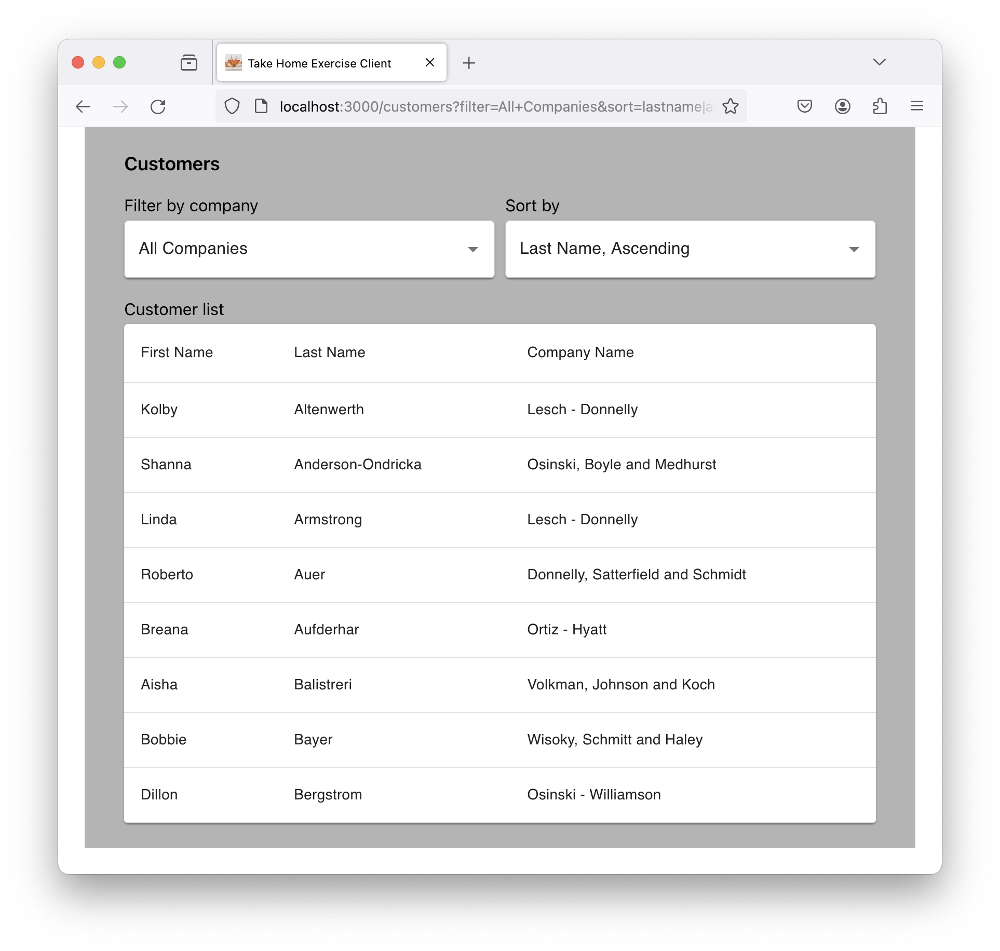

# Take Home Exercise Client

An example of a take home exercise client solution.
</br>


## About

The client is built on React with Material UI components and is written in JavaScript with ES6 modules.

The client implements the Filter (B) and Sort (C) requirements.

## Usage

### Running

The following sections describe how to set up and run the server and client services used by the client application.

#### Start Server

##### Run a terminal application and use the following commands to install and start the server:

```shell
git clone https://github.com/kimnetics/take-home-exercise-server
cd take-home-exercise-server
npm install
npm run build
npm start
```

The above commands do the following:
* Clone the [Take Home Exercise Server](https://github.com/kimnetics/take-home-exercise-server) repo.
* Change directory to the newly created server directory.
* Install needed packages.
* Build and start the server.

The server listens on port 4000.

You can optionally enter a New Relic license key in the `license_key` field in the `newrelic.cjs` file if you would like to monitor the server with New Relic. The server shows in the New Relic APM section as `take-home-exercise-server`.

#### Start Client

##### Run a terminal application and use the following commands to install and start the client:

```shell
git clone https://github.com/kimnetics/take-home-exercise-client
cd take-home-exercise-client
npm install
npm start
```

The above commands do the following:
* Clone the [Take Home Exercise Client](https://github.com/kimnetics/take-home-exercise-client) repo.
* Change directory to the newly created client directory.
* Install needed packages.
* Start the server.

The client listens on port 3000.

### Testing

After the client is installed, run the unit tests with the following command:

```shell
npm test
```
